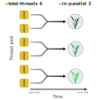
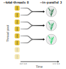

# PHGv2 - Building and Loading

In this document, we will discuss the steps needed to:
1. Set up a working Conda environment containing the required
   external software
2. Initialize a [TileDB-VCF](https://docs.tiledb.com/main/integrations-and-extensions/genomics/population-genomics) instance
3. Build VCF data
4. Loading data into TileDB-VCF instances

## Quick start
* Set up the PHGv2 Conda environment:
    ```shell
    phg setup-environment --env-file phg_environment.yml
    ```
* Initialize TileDB instances:
    ```shell
    phg initdb --db-path /path/to/dbs
    ```
* Create BED file from GFF for reference range coordinates:
    ```shell
    phg create-ranges \
        --reference-file /my/ref.fasta \
        --gff my.gff \
        --boundary gene \
        --pad 500 \
        -o /path/to/bed_file.bed
    ```
* Align assemblies:
    ```shell
    phg align-assemblies \
        --gff anchors.gff \
        --reference-file /my/ref.fasta \
        --assemblies assemblies_list.txt \
        -o /path/for/generated_files
    ```
* Update FASTA headers with sample information:
    ```shell
    phg annotate-fastas \
        --keyfile /path/to/keyfile \
        --output-dir /path/to/annotated/fastas \
        --threads 10
    ```
* Compress FASTA files
    ```shell
    phg agc-compress \
        --db-path /path/to/dbs \
        --reference-file \
        --fasta-list /my/assembly_fasta_list.txt
    ```
* Create VCF files
    ```shell
    # Reference VCF
    phg create-ref-vcf \
        --bed /path/to/bed_file.bed \
        --reference-file /my/ref.fasta \
        --reference-name B73 \
        -o /path/to/ref_vcf.vcf
  
    # MAF alignments VCF
    phg create-maf-vcf \
        --db-path /path/to/dbs \
        --bed /path/to/bed_file.bed \
        --reference-file /my/ref.fasta \
        --maf-dir /my/maf/files \
        -o /path/to/vcfs
    ```
* Load data into DBs
    ```shell
    phg load-vcf \
        --vcf /my/vcf/dir \
        --db-path /path/to/dbs \
        --threads 10
    ```

## Detailed walkthrough

### Preamble
For the following steps, I will first make an example directory to
house our toy input data. The overall structure of the directory
looks like the following

```shell
phg_v2_example/
├── data
└── output
```

For the following steps, I will be using example small sequence
data from [PHGv2 GitHub repository](https://github.com/maize-genetics/phg_v2/tree/main/data/test/smallseq).
This is a collection of small raw sequence and alignment files that
we use for pipeline testing. These will be placed in the `data`
subdirectory while files created by this pipeline will be placed in
the `output` subdirectory.

This documentation will also assume that the PHGv2 application is 
placed in your system's `PATH` variable (_see installation 
documentation for further details_).

### Set up Conda environment
Once you have downloaded the latest release of PHGv2 and have Conda 
installed (_see installation documentation_), you will first need to set up a 
Conda environment to accommodate the necessary pieces of software for 
alignment and storage. Here is a list of essential pieces of
software that will be installed in your Conda environment:

| Software   | Purpose                                                    |
|------------|------------------------------------------------------------|
| agc        | Performant FASTA genome compression                        |
| AnchorWave | Sensitive aligner for genomes with high sequence diversity |
| bcftools   | Utilities for indexing VCF data                            |
| samtools   | bgzip compression for VCF data                             |
| TileDB     | Performant storage core for array data                     |
| TileDB-VCF | API for storing and querying VCF data                      |

Instead of setting this up manually, we can use the 
`setup-environment` command which will automate this process. To
run, use the following command:

```shell
phg setup-environment --env-file phg_environment.yml
```

This command takes one parameter, `--env-file`. This is a path to the 
Conda environment file. You can create the file 
from scratch (`phg_environment.yml`)  and copy over the contents in 
the following block:

```
name: phgv2-conda
channels:
  - conda-forge
  - bioconda
  - tiledb
dependencies:
  - python=3.8
  - tiledb-py=0.22
  - tiledbvcf-py=0.25
  - anchorwave
  - bcftools
  - samtools
  - agc
```

Another option is to pull in the environment file directly from the 
[GitHub repository](https://github.com/maize-genetics/phg_v2):

```shell
curl https://raw.githubusercontent.com/maize-genetics/phg_v2/main/src/main/resources/phg_environment.yml -o phg_environment.yml
```

After the setup step is complete, we can activate our environment
using the following conda command:

```shell
conda activate phgv2-conda
```

If we look in our example project directory, you will also see two
new logging (`.log`) files which will record all the logging and
error output from the PHGv2 command steps:

* `condaCreate_error.log`
* `condaCreate_output.log`


### Initialize TileDB instances
In PHGv2, we leverage [TileDB](https://tiledb.com/) and 
[TileDB-VCF](https://docs.tiledb.com/main/integrations-and-extensions/genomics/population-genomics) 
for efficient storage and querying of VCF data. For downstream 
pipelines, we will need to set up 2 databases for storing different
VCF information: (1) haplotype and (2) genomic variant information.

Similar to setting
up our Conda environment from the prior section, we can automate this
process using the `initdb` command:

```shell
./phg initdb --db-path vcf_dbs
```

This command takes one parameter, `--db-path` which is the path or
subdirectory to where we want to place our databases. In this
example project, I will set up the databases in a subdirectory called
`vcf_dbs`.

After initialization is complete, we will have two empty TileDB-VCF
instances and a `temp` directory in our `vcf_dbs` subdirectory:

| Directory      | Purpose                                 |
|----------------|-----------------------------------------|
| `gvcf_dataset` | Genomic variant storage                 |
| `hvcf_dataset` | Haplotype variant storage               |
| `temp`         | Creation output and error logging files |

### Create reference ranges
Next, we must define ordered sequences of genic and inter-genic 
ranges across the reference genome. These ordered ranges, which we 
will call "reference ranges", are used to specify haplotype sequence 
coordinate information for the haplotype and genomic variant call 
format data. These genomic positions are structured using the 
[BED](https://en.wikipedia.org/wiki/BED_(file_format)) format.

Generally, this data is not readily available as BED files. PHGv2
can generate this file directly from 
[GFF](https://en.wikipedia.org/wiki/General_feature_format)-formatted 
data using the `create-ranges` command:

```shell
./phg create-ranges \
    --gff data/anchors.gff \
    --reference-file data/Ref.fa \
    --boundary gene \
    --pad 500 \
    -o output/ref_ranges.bed
```

This command uses several parameters:

* `--gff` - Our reference GFF file of interest. Since 
  reference ranges are usually established by genic/intergenic 
  regions, we can leverage coordinate and feature information from
  GFF files.
* `--reference-file` - Our reference genome in 
  [FASTA](https://en.wikipedia.org/wiki/FASTA_format) format. This
  is needed for determining the intergenic regions near the ends of 
  chromosomes.
* `--boundary` - How do you want to define the boundaries of the 
  reference ranges. Currently, these can be defined as either
  `gene` or `cds` regions:

  
  
  + In the above figure, if `--boundary` is set to `gene`, the start
    and end positions are at the UTR regions for each gene feature from
    the GFF file, while `cds` will begin and end at the open reading 
    frame. By default, the `cds` option will try to identify the
    transcript with the longest open reading frame if there are
    multiple transcript "children" for a gene "parent" in the GFF
    file.
* `--pad` - The number of base pairs you would like to flank regions:

  

  + For example, if we were to set the `--pad` parameter to `500`,
    we would extend the region 500 base pairs upstream and downstream
    of the defined boundary (in this case, `gene`).

> [!NOTE]
> There is a possibility that overlaps of regions will occur. If
> this does happen, `create-ranges` will identify any overlapping
> regions and merge regions together:
> ```
> [---Overlap 1----]
>            [-------Overlap 2-------]
> ====================================
> [---------Merged overlap-----------]
>  ```
  
* `-o` - Name for the output BED file.

In the above example, I am using test data from the 
[PHGv2 GitHub repository](https://github.com/maize-genetics/phg_v2/tree/main/data/test/smallseq).
After the command is finished, we have produced a BED file (which
in my case, is located in a subdirectory labelled `output`). This BED 
file contains 6 columns of information:

| Column | Value               |
|--------|---------------------|
| `1`    | Sequence name       |
| `2`    | Start position (bp) |
| `3`    | End position (bp)   |
| `4`    | Range id            |
| `5`    | Score (always `0`)  |
| `6`    | Strand information  |

> [!NOTE]
> Column `4` will either be gene or cds name depending on the boundary
> input.  If regions overlapped and were merged, the name is a comma 
> separated string of all the genes/CDS features included in this BED 
> region.


### Align assemblies
Next, we must align our collection of genome assemblies against a
single reference genome in order to have a common coordinate system
across all genomes within our PHG databases. While whole genome
alignment can be performed in a multitude of ways, PHGv2 provides an
opinionated wrapper to [AnchorWave](https://doi.org/10.1073/pnas.2113075119), 
which uses an **Anchor**ed **Wave**front alignment approach for 
genomes with high sequence diversity, extensive structural 
polymorphism, or whole-genome duplications. Since this software is
already set up during the Conda environment step, there is no need
to install this manually.

> [!NOTE]
> For best results with imputation and rare allele calling pipelines, 
> **please use high quality assemblies**!

To run the aligner step, we can call the `align-assemblies` command:

```shell
./phg align-assemblies \
    --gff data/anchors.gff \
    --reference-file data/Ref.fa \
    --assemblies data/assemblies_list.txt \
    --total-threads 20 \
    --in-parallel 2 \
    -o output/alignment_files
```

This command uses several parameters:
* `--gff` - GFF file for the reference genome. This is used to
  identify full-length coding sequences to use as anchors
* `--reference-file` - The reference genome in 
  [FASTA](https://en.wikipedia.org/wiki/FASTA_format) format.
* `--assemblies` - A text file containing a list of assembly genomes.
  The contents of this file should be either full or relative paths
  to each assembly you would like to align. For example, since I am
  using the example data found on the 
  [PHGv2 GitHub repository](https://github.com/maize-genetics/phg_v2/tree/main/data/test/smallseq),
  I can create a text file called `assemblies_list.txt` and populate
  it with the following lines:

  ```
  data/LineA.fa
  data/LineB.fa
  ```
  Here, I am planning on aligning two genomes called `LineA` and 
  `LineB`. Since these are located in a subdirectory called `data`
  relative to my working directory, I will also add that to the path.

* `-o` - The name of the directory for the alignment outputs.

  
In addition to the above parameters, there are two optional parameters. When values are not specified for these parameters,
default values are calculated by the software based on the system processor and memory configuration.

* `--total-threads` - How many threads would you like to allocate for
  the alignment step? More information about this step and the 
  `--in-parallel` step can be found in the following **Details - 
  threads and parallelization** section.
* `--in-parallel` - How many genomes would like to run in parallel?
  More information about this step and the `--total-threads` step can
  be found in the following **Details - threads and parallelization** 
  section.


> [!WARNING]
> The directory that you specify in the output (`-o`) section must
> be an existing directory.

Once alignment is finished, and you have navigated into the output 
directory (in my case, this would be `output/alignment_files`),
you will see several different file types. In addition to various 
logging files (`.log`) for the AnchorWave procedures, you will notice 
that each assembly will have a collection of different file types:

| File extension | Property                                                                                   |
|----------------|--------------------------------------------------------------------------------------------|
| `.sam`         | [sequence alignment map](https://en.wikipedia.org/wiki/SAM_(file_format)) (SAM) file       |
| `.maf`         | [multiple alignment format](https://genome.ucsc.edu/FAQ/FAQformat.html#format5) (MAF) file |
| `.anchorspro`  | alignment blocks between reference and assembly genomes (used for dot plot generation)     |

The MAF files from this output will be used in the VCF creation step.

#### Internal AnchorWave and minimap2 commands
While PHGv2 is flexible in terms of how data is processed, we have
taken several opinionated steps with how the AnchorWave aligner runs
in the `align-assemblies` command. If you are interested with what
parameters are utilized, search for `ProcessBuilder()` methods within
our [`AlignAssemblies.kt` source code](https://github.com/maize-genetics/phg_v2/blob/main/src/main/kotlin/net/maizegenetics/phgv2/cli/AlignAssemblies.kt)
or review the following code blocks:

* Run AnchorWave's `gff2seq` command:
  ```shell
  # Get the longest full-length CDS for each gene
  anchorwave gff2seq \
      -r <'--reference-file' parameter> \
      -i <'--gff' parameter> \
      -o ref.cds.fasta # directed to '-o' path
  ```
* Run minimap2
  ```shell
  # AnchorWave liftover steps (ref CDS to query)
  minimap2 \
      -x "splice" \
      -t < '--total-threads' parameter > \
      -k 12 \ 
      -a \
      -p 0.4 \
      -N 20 \
      <'--reference-file' parameter OR sample in '--assemblies' parameter> \
      ref.cds.fasta \      # from prior 'gff2seq' step
      -o <sample_name>.sam # drected to '-o' path
  ```
* Run AnchorWave's `proali` command:
  ```shell
  anchorwave proali \
      -i <'--gff' parameter> \
      -r <'--reference-file' parameter> \
      -as ref.cds.fa \
      -a <assembly_sample.sam> \
      -ar <ref_assembly.sam> \
      -s <assembly_sample.fa> \
      -n <assembly_ref.anchorspro> \
      -R 1 \    # manually set via --ref-max-align-cov
      -Q 1 \    # manually set via --query-max-align-cov
      -t <'--total-threads' / '--in-parallel' parameter> \
      -o <assembly_sample.maf>
  ```
> [!NOTE]
> In the above `proali` command, the maximum reference genome 
> alignment coverage (`-R`) and maximum query genome coverage (`-Q`)
> can be manually set using the `--ref-max-align-cov` and 
> `--query-max-algin-cov` commands, respectively. If these are not
> set, they will both default to the value of `1` as shown in the
> prior `-R` and `-Q` parameters.


#### Details - threads and parallelization
Aligning with anchorwave is memory intensive and can be slow.  Processing speed may be increased by
using multiple threads for each alignment, and/or by running multiple alignments in parallel.  The amount of memory
each thread takes is dependent on the processor type.  The table below shows the memory usage for a single
alignment based on processor type:

| Processor | peak memory (GB) | wall time |
|-----------|------------------|-----------|
| SSE2      | 20.1             | 26:47:17  |
| SSE4.1    | 20.6             | 24:05:07  |
| AVX2      | 20.1             | 21:40:00  |
| AVX512    | 20.1             | 18:31:39  |
| ARM       | 34.2             | 18:08:57  |

The `--total-threads` parameter indicates the total number of threads available for system use.  The `--in-parallel`
parameter controls the number of alignments run in parallel.  When these values are not specified, the software will
compute the optimal values based on the system processor and memory configuration. 

The number of threads that may be run in parallel is limited by the amount of memory available.  The
system is queried for memory and processor information.  The number of threads that may be run in parallel
is determined by "system memory" / "peak memory" from the table above.  To generalize the calculation, we divide
memory available (GiB) by 21 and round down to the nearest integer.

For example, if the system has 512 GB of memory, 80 processors and 5 assemblies that need aligning,
the maximum number of threads that could be run in parallel is 24 (512/21).  The number of potential parallel
alignments with the threads allocated for each is shown in the table below


| Alignments in parallel | Threads per alignment |
|------------------------|-----------------------|
| 5                      | 4                     |
| 4                      | 6                     |
| 3                      | 8                     |
| 2                      | 12                    |
| 1                      | 24                    |

The software will select a pairing that maximizes the number of alignments run in parallel while utilizing multiple threads, 
opting for a value in the middle.  In the case above with 5 assemblies and a possibility of 24 concurrent threads,
the system will choose to run 3 alignments in parallel with 8 threads each.  The total number of threads used
will be 24 (3 * 8).

User defined values for in-parallel and total-threads are considered along with the number of assemblies to
align and system capacities, when determining the anchorwave setup.


[//]: # ()
[//]: # (***WIP*** - revisit once we can agree on naming and parameter conventions)

[//]: # ()
[//]: # ()

[//]: # ()
[//]: # (***WIP*** - revisit once we can agree on naming and parameter conventions)

[//]: # ()
[//]: # ()

[//]: # ()
[//]: # ()
[//]: # (The table below shows the memory usage for a single assembly alignment)

[//]: # (based on processor type:)

[//]: # ()
[//]: # (| Processor | peak memory &#40;Gb&#41; | wall time |)

[//]: # (|-----------|------------------|-----------|)

[//]: # (| SSE2      | 20.1             | 26:47:17  | )

[//]: # (| SSE4.1    | 20.6             | 24:05:07  |)

[//]: # (| AVX2      | 20.1             | 21:40:00  |)

[//]: # (| AVX512    | 20.1             | 18:31:39  |)

[//]: # (| ARM       | 34.2             | 18:08:57  |)

### Annotate Fastas
As of the current date of this document, the return methods of
AGC will not keep track of sample IDs when returning
sequence information from the compressed file **unless you explicitly
state the sample information in the header lines of the FASTA files
you wish to compress for the PHGv2 databases**. To explain this
further, let's imagine that we have two FASTA files: `LineA.fa` and
`LineB.fa`. These files contain information for only chromosome 1 and
have a simple header that denotes this sequence name (e.g. `chr1`):

```
$ head LineA.fa
>chr1
ATGCGTACGCGCACCG

$ head LineB.fa
>chr1
ATGCGTTCGCCTTCCG
```

After we compress this information using the `agc-compress` command,
we will have a file called `assemblies.agc`. PHGv2 leverages this
compressed sequence file when creating VCF data (_see
the [**"Create VCF files"**](#create-vcf-files) section for further
details_). The issue arrives when we query the compressed data using
[AGC's `getctg`](https://github.com/refresh-bio/agc#extract-contigs-from-the-archive)
command. When we query this hypothetical archive, we will get the
following information:

```
$ agc getctg assemblies.agc chr1@LineA chr1@LineB > queries.fa

$ head queries.fa
>chr1
ATGCGTACGCGCACCG
>chr1
ATGCGTTCGCCTTCCG
```

As you can see from the above hypothetical output, we now have no
means to efficiently track where each sequence is coming from due
to the lack of header information from our prior FASTA files. We
can remedy this by adding sample information to the headers:

```
$ head LineA.fa
>chr1 sampleName=LineA
ATGCGTACGCGCACCG

$ head LineB.fa
>chr1 sampleName=LineB
ATGCGTTCGCCTTCCG
```

Now, when we compress and query using AGC, we get enhanced sample ID
tracking:

```
$ ./agc getctg assemblies_new_headers.agc chr1@LineA chr1@LineB > queries.fa

$ head queries.fa
>chr1 sampleName=LineA
ATGCGTACGCGCACCG
>chr1 sampleName=LineB
ATGCGTTCGCCTTCCG
```

While we can either manually modify the header lines of our FASTA
file, this can become tedious and prone to a new set of downstream
errors. To automate this, PHGv2 provides an optional command to
append sample information to the headers of each FASTA file called
`annotate-fastas`:

```shell
phg annotate-fastas \
    --keyfile data/annotation_keyfile.txt \
    --threads 10 \
    --o output/annotated_assemblies
```

This command takes 3 parameters:

* `--keyfile` - A [tab-delimited](https://en.wikipedia.org/wiki/Tab-separated_values)
  keyfile containing two columns:

| Column | Value                                                                                                                                                                                                                      |
|--------|----------------------------------------------------------------------------------------------------------------------------------------------------------------------------------------------------------------------------|
| 1      | Path to FASTA file you would like annotated (this is similar to the text files used to point to the FASTA file paths in the [`agc-compress`](#compress-fasta-files) and [`align-assemblies`](#align-assemblies) commands). |
| 2      | Name of the sample that will be appended to each header line                                                                                                                                                               |

  + My example `annotation_keyfile.txt` file would look like this:

  ```
  data/LineA.fa   LineA
  data/LineB.fa   LineB
  ```
* `--threads` - Optional number of threads to annotate multiple
  FASTA files in parallel. _Defaults to `1`_.
* `-o` - Output directory for the newly annotated FASTA files

> [!WARNING]
> This step must be performed before the `agc-compress` step.

> [!WARNING]
> Sample IDs in the keyfile must match with what is found in the
> TileDB instances.

> [!NOTE]
> FASTA files can be either uncompressed or compressed. If
> compressed, the extension should be `*.gz`.

Once finished, this command will produce FASTA files with the name
of the sample from the keyfile appended to each header line. For
example, in our hypothetical FASTA files, our headers go from this:

```
$ head LineA.fa
>chr1
ATGCGTACGCGCACCG
```

to this:

```
$ head LineA.fa
>chr1 sampleName=LineA
ATGCGTACGCGCACCG
```

>[!NOTE]
>This command will just append the name of a file to the end of the
>FASTA headers. For example, if we had a more detailed header:
>
>```
>chr1 pos=1:16
>ATGCGTACGCGCACCG
>```
>
>...the header would become:
>
>```
>chr1 pos=1:16 sampleName=LineA
>ATGCGTACGCGCACCG
>```


### Compress FASTA files
For optimal storage of sequence information, we can convert our 
"plain-text" FASTA files into a more compact representation using 
compression. For PHGv2, we can use a command called `agc-compress`, 
which is a wrapper for the
[Assembled Genomes Compressor](https://github.com/refresh-bio/agc) 
(AGC). AGC provides performant and efficient compression ratios for 
our assembly genomes. Like AnchorWave, AGC is also installed during
the Conda environment setup phase, so there is no need to install 
this manually.

To run the compression step, we can call the `align-assemblies` 
command:

```shell
./phg agc-compress \
    --db-path vcf_dbs \
    --fasta-list data/assemblies_list.txt \
    --reference-file data/Ref.fa
```

This command takes in 3 parameters:
* `--db-path` - path to directory storing the TileDB instances. The
  AGC compressed genomes will be placed here on completion.

> [!NOTE]
> The directory specified here should be the same directory used to 
> initialize the TileDB instances in the database initialization 
> (`initdb`) step.

* `--fasta-list` - List of assembly FASTA genomes to compress.

> [!NOTE]
> The list specified in `--fasta-list` _can_ be the same list used
> in the alignment (`align-assemblies`) step, but make sure header
> information in each FASTA contains sample IDs. See the 
> [**"Important information regarding `agc` compression"**](#warning-important-information-regarding-agc-compression-warning)
> section for further information and how to remedy this.

* `--reference-file` - Reference FASTA genome.

After compression is finished, we can navigate to the directory
containing the TileDB instances. In my case, this would be the
subdirectory, `vcf_dbs`. Here, you will see a new file created:
`assemblies.agc`. This is the compressed AGC file containing our 
assemblies. This file will be used later to query for haplotype
sequence regions and composite genome creation.


### Create VCF files
Now that we have (1) created alignments of our assemblies against a
single reference genome and (2) created compressed representations
of our assembly genomes, we can now create VCF information to
populate our TileDB instances. This process is performed using two
commands:

1. Create hVCF data from reference genome:

```shell
phg create-ref-vcf \
    --bed output/ref_ranges.bed \
    --reference-file data/Ref.fa \
    --reference-name B73 \
    -o output/vcf_files
```

2. Create hVCF and gVCF data from assembly alignments against reference
   genome:

```shell
phg create-maf-vcf \
    --db-path vcf_dbs \
    --bed output/ref_ranges.bed \
    --reference-file data/Ref.fa \
    --maf-dir output/alignment_files \
    -o output/vcf_files
```

> [!TIP]
> For more information about the haplotype VCF (hVCF) specification,
> please refer to the hVCF specification documentation.

VCF creation is split up into two separate commands since the
reference genome and aligned assemblies require different sets of
data:

#### `create-ref-vcf` inputs
The `create-ref-vcf` command requires the following inputs:

* `--bed` - A BED file containing ordered reference ranges (_see
  the [**"Create reference ranges"**](#create-reference-ranges) section for further details_). This
  is used to define the positional information of the VCF.
* `--reference-file` - Reference FASTA genome used for creating
  MD5 hashes of sequence information guided by reference range
  positional data from the BED file used in the `--bed` parameter.
* `--reference-name` - The name of the reference sample
* `-o` - Output directory for the VCF data.

> [!WARNING]
> The directory that you specify in the output (`-o`) section must
> be an existing directory.

> [!NOTE]
> Optionally, `create-ref-vcf` can also use another parameter, 
> `--reference-url`. This is an optional URL where the reference
> FASTA file can be downloaded. This will be added to the VCF header
> information.

Once the command is complete, and you have navigated into the output
directory (in my case, `output/vcf_files`), you will see two files:


| File                      | Description                                              |
|---------------------------|----------------------------------------------------------|
| `<ref_name>.h.vcf.gz`     | compressed reference haplotype VCF (hVCF) file           |
| `<ref_name>.h.vcf.gz.csi` | coordinate sorted index (CSI) of the reference hVCF file |

Here, `<ref_name>` is the name of the reference genome provided
using the `--reference-name` parameter. Since I defined this
parameter as `B73` in the above example, my two files would be:

* `B73.h.vcf.gz`
* `B73.h.vcf.gz.csi`

#### `create-maf-vcf` inputs
The `create-maf-vcf` command requires the following inputs:

* `--db-path` - Path to the directory containing the TileDB 
  instances. This is needed to access the AGC compressed assembly
  genome information found in the `assemblies.agc` file (_see the 
  [**"Compress FASTA files"**](#compress-fasta-files) section for further details_).
* `--bed` - A BED file containing ordered reference ranges (_see
  the [**"Create reference ranges"**](#create-reference-ranges) section for further details_). This
  is used to define the positional information of the VCF in relation
  to the reference genome.
* `--reference-file` - Reference FASTA genome used for creating
  MD5 hashes of sequence information guided by reference range
  positional data from the BED file used in the `--bed` parameter.
  hashed sequence data will place in the `##ALT` tag's `RefRange`
  key.
* `--maf-dir` - Directory containing the MAF files generated using
  the `align-assemblies` command (_see the [**"Align assemblies"**](#align-assemblies) 
  section for further details_).
* `-o` - Output directory for the VCF data.

> [!WARNING]
> The directory that you specify in the output (`-o`) section must
> be an existing directory.

Once the command is complete, and you have navigated into the output
directory (in my case, `output/vcf_files`), you will see a collection
of different file types for each sample:


| File                         | Description                                              |
|------------------------------|----------------------------------------------------------|
| `<sample_name>.h.vcf.gz`     | compressed reference haplotype VCF (hVCF) file           |
| `<sample_name>.h.vcf.gz.csi` | coordinate sorted index (CSI) of the reference hVCF file |
| `<sample_name>.g.vcf.gz`     | compressed reference genomic VCF (gVCF) file             |
| `<sample_name>.g.vcf.gz.csi` | coordinate sorted index (CSI) of the reference gVCF file |

Here, `<sample_name>` would be the name of each sample that was
aligned to the reference genome.

### Load VCF data into DBs
After VCF files are created, we can finally load the information
into our empty TileDB instances. Instead of manually performing this
action, we can use the `load-vcf` command to automatically load hVCF
and gVCF files into their respective TileDB directories:

```shell
./phg load-vcf \
    --vcf output/vcf_files \
    --db-path vcf_dbs \
    --threads 10
```

This command takes three parameters:
* `--vcf` - Directory containing `h.vcf.gz` and/or `g.vcf.gz` 
  files made from the `create-ref-vcf` and `create-maf-vcf` commands
  (_See the [**"Create VCF files"**](#create-vcf-files) section for 
  further details_). In my example case this is a subdirectory
  called `output/vcf_files`.
* `--db-path` - Path to the directory containing the TileDB instances.
* `--threads` - Number of threads for use by the TileDB loading
  procedure.

