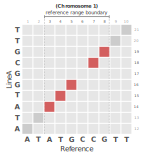
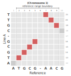

# PHGv2 - haplotype region handling

In this document, we will go into further detail about how
regions are reported in the alternative allele field of an hVCF file 
and possible edge cases that may arise in hVCF creation.

## Alternative allele fields - an overview

> [!NOTE]
> For more information about this hVCF field and other general
> information about hVCF specifications, please review the
> [haplotype VCF specification](hvcf_specifications.md) article.

The alternative allele (`##ALT`) field contains key-value information
that represents the haplotype sequence and ID for a given
reference-range in the PHG. One key-value pair is the `Regions` key.
This represents the physical location of the sequence in the genome
assembly FASTA file.

A common example of this would be the following example:

```
##ALT=<ID=57705b1e2541c7634ea59a48fc52026f,Description="haplotype data for line: LineA",Source="data/test/smallseq/LineA.fa",Regions=1:14-19,Checksum=Md5,RefRange=06ae4e937668d301e325d43725a38c3f>
```

...we have the following regions key:

```
Regions=1:14-19
```

...for the following assembly/sample:

```
Description="haplotype data for line: LineA"
```

This indicates that for `LineA`, we have a haplotype sequence that
aligned against the given reference range (denoted with the MD5 hash,
`06ae4e937668d301e325d43725a38c3f`) at chromosome 1 (`1:`) between
the values of 14 and 19 (`14-19`) base-pairs. We can represent this
graphically with a dot plot:



In the above example, `LineA` (y-axis) is aligned against our
reference genome, in this case, identified as `Reference` (x-axis).
The reference range boundary is located on chromosome 1 between the
base pairs of 3 and 8 (_denoted by the dashed lines_). Given our 
hypothetical alignment scenario, our sample, `LineA`, aligned against 
the reference genome also on chromosome 1, but due to structural
variations between the two genomes, matches at different base-pair
positions (in this case between `14` and `19` base-pairs). Using
this region value, we can navigate back to `LineA`'s FASTA file and
identify the sequence region:


## Possible edge cases - inversions

Given the possibility of structural diversity events between the
reference and assembly genomes. There are edge cases where a
reference range boundary can land on 
[inversion regions](https://www.genome.gov/genetics-glossary/Inversion).
For example, let's illustrate this scenario with another dot plot:



Here, when we align `LineA` against the reference, there is an 
inversion at the end of this boundary. How do we represent this using
our `Region` key-value pairing scheme in the alternate allele field?
The `Region` key can house multiple region elements using comma
(`,`) separated values. Using the above example, this can be
displayed as follows:

```
Regions=1:13-16,1:21-19
```

