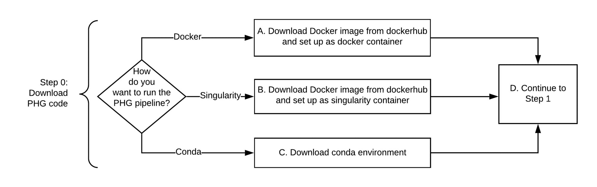

!!! warning "Legacy Documentation - PHG Version 1"

    This section contains documentation for **PHG version 1**, which is
    no longer actively developed. It is preserved here for archival and
    historical reference only. If you are looking to use the Practical
    Haplotype Graph, please refer to the [PHG v2 documentation](../../index.md),
    which reflects the current version of the software.

# Use the flow chart and links below to download the PHG code

A. [Run PHG with Docker](create_phg_step0_docker.md)

B. [Run PHG with Singularity](create_phg_step0_singularity.md)

C. [Run PHG with Conda](create_phg_step0_conda.md)

D. Test the Docker by creating and running an [example](example_database.md) or 

E. [Proceed to Step 1](create_phg_step1_2_main.md)

[Return to Wiki Home](../home.md)